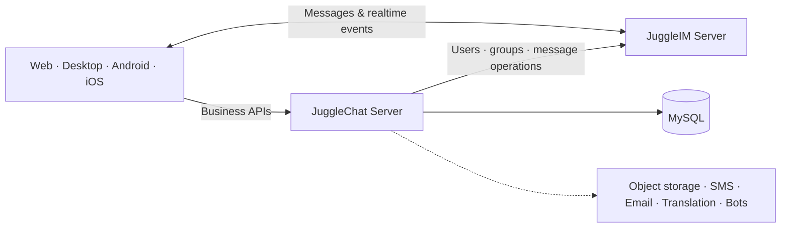

<div align="center">
  

  <h1>JuggleChat Server</h1>

  <h3>Open-source, self-hosted instant messaging for every platform</h3>

  <p>
    A production-ready chat business server built on <a href="https://github.com/juggleim/im-server">JuggleIM</a>.<br />
    Ship private chat, groups, contacts, authentication, file storage, translation, bots, and more—without building the business layer from scratch.
  </p>

  <p>
    <a href="https://github.com/juggleim/jugglechat-server"></a>
    <a href="https://github.com/juggleim/jugglechat-server/releases"></a>
    <a href="https://github.com/juggleim/jugglechat-server/blob/master/LICENSE"></a>
    
  </p>

  <p>
    <a href="https://juggle.im/"><strong>Explore JuggleChat</strong></a>
    ·
    <a href="https://www.juggle.im/docs/guide/deploy/quickdeploy/">Deployment Guide</a>
    ·
    <a href="https://github.com/juggleim/jugglechat-server">GitHub</a>
    ·
    <a href="README.zh-CN.md">简体中文</a>
  </p>
</div>

---

## Why JuggleChat?

Most IM engines solve message delivery—not the product logic around it. JuggleChat provides the ready-to-use business layer between your clients and JuggleIM, so you can launch a complete messaging product faster while keeping your infrastructure and data under your control.

- **Complete social experience** — accounts, profiles, contacts, friend requests, block lists, groups, invitations, administrators, mute settings, and announcements.
- **Multiple sign-in flows** — password, SMS, email, and QR code login APIs.
- **Messaging operations** — message recall and deletion, conversation settings, notifications, and synchronized server configuration.
- **Extensible integrations** — S3-compatible storage, MinIO, Aliyun OSS, Qiniu, SMS/email providers, translation engines, Telegram bots, and assistant callbacks.
- **Cross-platform ecosystem** — first-party clients for Web, Desktop, Android, and iOS.
- **Self-hosting friendly** — a straightforward Go service backed by MySQL and the open-source JuggleIM server.

## How it fits together



> This repository contains the **JuggleChat business server** and an embedded Web client. Real-time message delivery is provided by [JuggleIM Server](https://github.com/juggleim/im-server).

## Quick start

### Prerequisites

- Go 1.23 or later
- MySQL 8.0 or later
- A running [JuggleIM Server](https://github.com/juggleim/im-server) instance

For the fastest JuggleIM setup, follow the [official deployment guide](https://www.juggle.im/docs/guide/deploy/quickdeploy/).

### 1. Clone the repository

```bash
git clone https://github.com/juggleim/jugglechat-server.git
cd jugglechat-server
```

Developers in mainland China can use the [Gitee mirror](https://gitee.com/juggleim/jugglechat-server):

```bash
git clone https://gitee.com/juggleim/jugglechat-server.git
cd jugglechat-server
```

### 2. Create the database

```sql
CREATE DATABASE app_db CHARACTER SET utf8mb4 COLLATE utf8mb4_0900_ai_ci;
```

The server applies its embedded schema migrations automatically on startup. To initialize the current schema manually instead, run:

```bash
mysql -u<db_user> -p app_db < docs/appbusiness.sql
```

### 3. Configure the server

```bash
cp conf/config_example.yml conf/config.yml
```

Update `conf/config.yml` with your environment:

```yaml
port: 8070
callbackPort: 8060

log:
  logPath: ./logs
  logName: jugglechat-server

mysql:
  user: <db_user>
  password: <db_password>
  address: 127.0.0.1:3306
  name: app_db

# JuggleIM Server API endpoint
imApiDomain: http://127.0.0.1:9001
```

### 4. Run

```bash
go run main.go
```

The business API is now available at `http://localhost:8070/jim`, and the embedded Web client is served at `http://localhost:8070/`.

To build a static Linux binary:

```bash
sh build.sh
```

## Core API domains

All business endpoints use the `/jim` prefix.

| Domain | Examples |
| --- | --- |
| Authentication | Password, SMS, email, and QR code login; registration |
| Users | Profiles, settings, account binding, search, online status, block lists |
| Friends | Requests, approval, contacts, aliases, search, deletion |
| Groups | Creation, invitations, applications, members, roles, mute and history settings |
| Messages | Recall and deletion |
| Conversations | Per-conversation settings |
| Integrations | File credentials, translation, Telegram bots, assistant callbacks |

See [`routers/router.go`](routers/router.go) for the complete route list.

## Client apps

Build once and deliver a consistent chat experience across platforms:

| Platform | Repository |
| --- | --- |
| Web | [jugglechat-web](https://github.com/juggleim/jugglechat-web) |
| Desktop | [jugglechat-desktop](https://github.com/juggleim/jugglechat-desktop) |
| Android | [jugglechat-android](https://github.com/juggleim/jugglechat-android) |
| iOS | [jugglechat-ios](https://github.com/juggleim/jugglechat-ios) |

## Project structure

```text
├── apis/        # HTTP handlers and request/response models
├── commons/     # Configuration, database, providers, and shared utilities
├── conf/        # Configuration template
├── docs/        # Database schema
├── routers/     # API routes and embedded Web client
├── services/    # Business logic
└── storages/    # Data access and persistence models
```

## Contributing

Issues and pull requests are welcome. A good way to contribute is to:

1. Check existing [issues](https://github.com/juggleim/jugglechat-server/issues) or open a focused proposal.
2. Fork the repository and create a feature branch.
3. Keep changes scoped and verify them locally.
4. Submit a pull request explaining the motivation and behavior change.

## Support the project

If JuggleChat saves you time, please [star the repository](https://github.com/juggleim/jugglechat-server)—it helps more developers discover the project and motivates the community to keep improving it.

## License

JuggleChat Server is available under the [Apache License 2.0](LICENSE).
