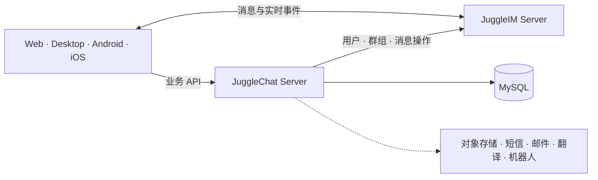

<div align="center">
  

  <h1>JuggleChat Server</h1>

  <h3>开源、可私有部署的全平台即时通讯系统</h3>

  <p>
    基于 <a href="https://github.com/juggleim/im-server">JuggleIM</a> 构建的可直接运营的 IM 业务服务。<br />
    无需从零开发业务层，即可拥有单聊、群聊、好友、登录、文件存储、翻译和机器人等完整能力。
  </p>

  <p>
    <a href="https://github.com/juggleim/jugglechat-server"></a>
    <a href="https://github.com/juggleim/jugglechat-server/releases"></a>
    <a href="https://github.com/juggleim/jugglechat-server/blob/master/LICENSE"></a>
    
  </p>

  <p>
    <a href="https://juggle.im/"><strong>了解 JuggleChat</strong></a>
    ·
    <a href="https://www.juggle.im/docs/guide/deploy/quickdeploy/">部署文档</a>
    ·
    <a href="https://gitee.com/juggleim/jugglechat-server">Gitee</a>
    ·
    <a href="README.md">English</a>
  </p>
</div>

---

## 为什么选择 JuggleChat？

大多数 IM 引擎解决的是消息收发问题，但一个真正可用的聊天产品还需要账号、好友、群组、登录和第三方服务等大量业务逻辑。JuggleChat 提供了客户端与 JuggleIM 之间开箱即用的业务层，帮助你更快交付完整的即时通讯产品，同时自主掌控基础设施和业务数据。

- **完整社交体验** — 账号、个人资料、好友申请、联系人、黑名单、群组、邀请、管理员、禁言和群公告。
- **多种登录方式** — 提供密码、短信、邮箱和二维码登录 API。
- **消息业务能力** — 消息撤回与删除、会话设置、业务通知和服务配置同步。
- **丰富扩展集成** — 兼容 S3 对象存储、MinIO、阿里云 OSS、七牛云、短信/邮件服务、翻译引擎、Telegram Bot 和 AI 助手回调。
- **全平台客户端** — 官方提供 Web、桌面、Android 和 iOS 客户端。
- **私有部署友好** — 基于 Go 与 MySQL，架构直观，并与开源 JuggleIM 服务无缝配合。

## 系统架构



> 本仓库包含 **JuggleChat 业务服务**及内置 Web 客户端；实时消息投递由 [JuggleIM Server](https://github.com/juggleim/im-server) 提供。

## 快速开始

### 环境要求

- Go 1.23 或更高版本
- MySQL 8.0 或更高版本
- 已运行的 [JuggleIM Server](https://github.com/juggleim/im-server) 实例

需要快速搭建 JuggleIM 时，请参考[官方部署文档](https://www.juggle.im/docs/guide/deploy/quickdeploy/)。

### 1. 克隆项目

国内开发者推荐使用 Gitee：

```bash
git clone https://gitee.com/juggleim/jugglechat-server.git
cd jugglechat-server
```

也可以从 GitHub 获取：

```bash
git clone https://github.com/juggleim/jugglechat-server.git
cd jugglechat-server
```

### 2. 创建数据库

```sql
CREATE DATABASE app_db CHARACTER SET utf8mb4 COLLATE utf8mb4_0900_ai_ci;
```

服务首次启动时会自动执行内置的数据库迁移。如需手动初始化当前表结构，可执行：

```bash
mysql -u<db_user> -p app_db < docs/appbusiness.sql
```

### 3. 配置服务

```bash
cp conf/config_example.yml conf/config.yml
```

根据实际环境修改 `conf/config.yml`：

```yaml
port: 8070
callbackPort: 8060

log:
  logPath: ./logs
  logName: jugglechat-server

mysql:
  user: <db_user>
  password: <db_password>
  address: 127.0.0.1:3306
  name: app_db

# JuggleIM Server API 地址
imApiDomain: http://127.0.0.1:9001
```

### 4. 启动

```bash
go run main.go
```

启动后，业务 API 地址为 `http://localhost:8070/jim`，内置 Web 客户端地址为 `http://localhost:8070/`。

构建 Linux 静态二进制文件：

```bash
sh build.sh
```

## 核心 API 模块

所有业务接口统一使用 `/jim` 前缀。

| 模块 | 主要能力 |
| --- | --- |
| 登录认证 | 密码、短信、邮箱、二维码登录与用户注册 |
| 用户 | 资料、设置、账号绑定、搜索、在线状态和黑名单 |
| 好友 | 申请、审批、联系人、备注、搜索和删除 |
| 群组 | 创建、邀请、申请、成员、角色、禁言和历史消息设置 |
| 消息 | 撤回与删除 |
| 会话 | 会话级设置 |
| 扩展集成 | 文件凭证、翻译、Telegram Bot 和助手回调 |

完整路由列表请查看 [`routers/router.go`](routers/router.go)。

## 全平台客户端

使用官方客户端，为不同平台提供一致的聊天体验：

| 平台 | 项目地址 |
| --- | --- |
| Web | [jugglechat-web](https://github.com/juggleim/jugglechat-web) |
| 桌面端 | [jugglechat-desktop](https://github.com/juggleim/jugglechat-desktop) |
| Android | [jugglechat-android](https://github.com/juggleim/jugglechat-android) |
| iOS | [jugglechat-ios](https://github.com/juggleim/jugglechat-ios) |

## 项目结构

```text
├── apis/        # HTTP 处理器与请求/响应模型
├── commons/     # 配置、数据库、第三方服务与公共工具
├── conf/        # 配置模板
├── docs/        # 数据库表结构
├── routers/     # API 路由与内置 Web 客户端
├── services/    # 业务逻辑
└── storages/    # 数据访问与持久化模型
```

## 参与贡献

欢迎提交 Issue 和 Pull Request：

1. 查看已有 [Issues](https://github.com/juggleim/jugglechat-server/issues)，或提交一个目标明确的新提议。
2. Fork 本仓库并创建功能分支。
3. 保持改动聚焦，并在本地完成验证。
4. 提交 Pull Request，清楚说明改动动机和行为变化。

## 支持项目

如果 JuggleChat 帮你节省了时间，欢迎为项目点一个 [Star](https://github.com/juggleim/jugglechat-server)。你的支持能让更多开发者发现它，也会激励社区持续完善项目。

## 开源协议

JuggleChat Server 基于 [Apache License 2.0](LICENSE) 开源。
